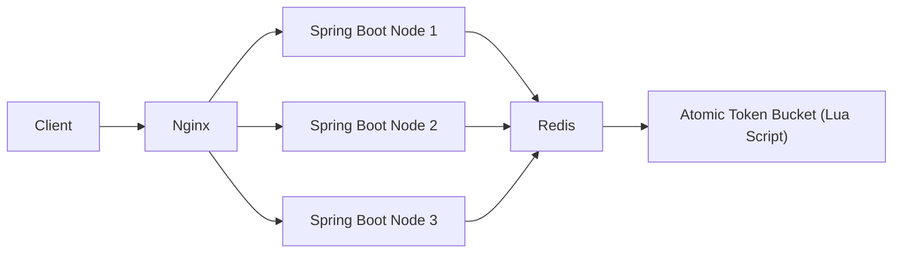
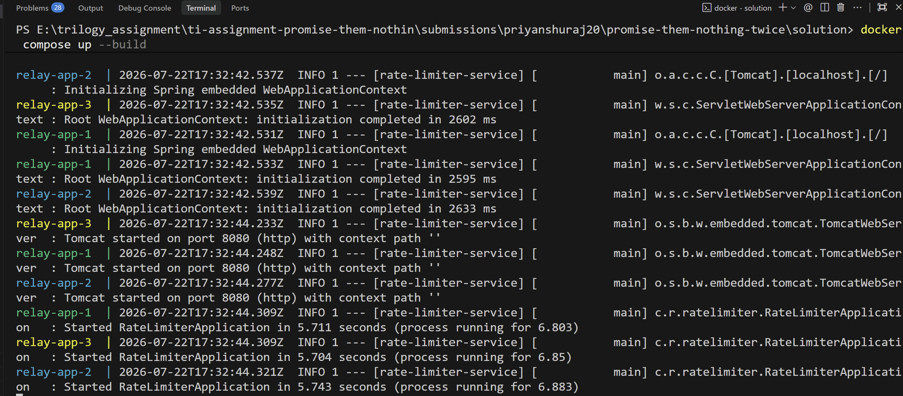
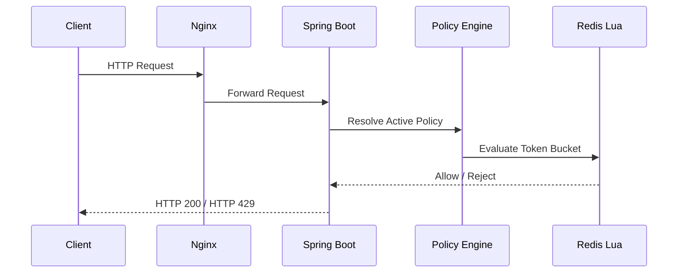
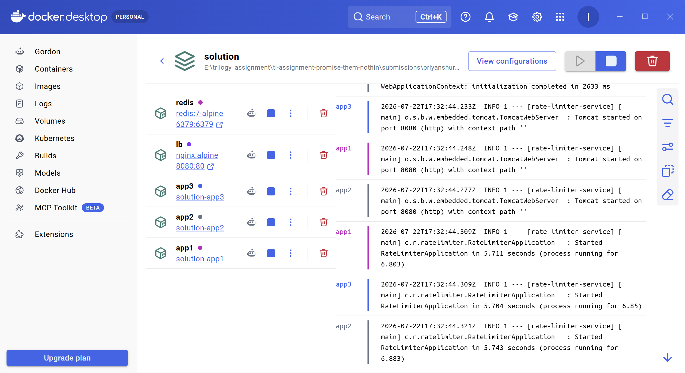
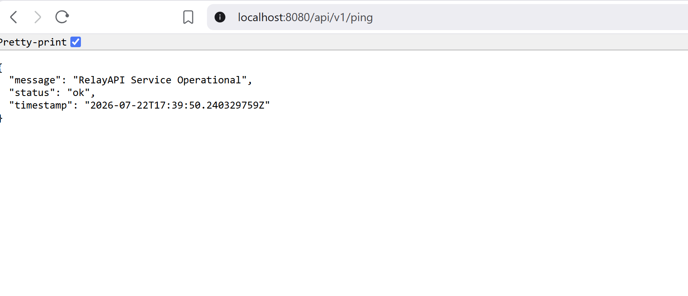
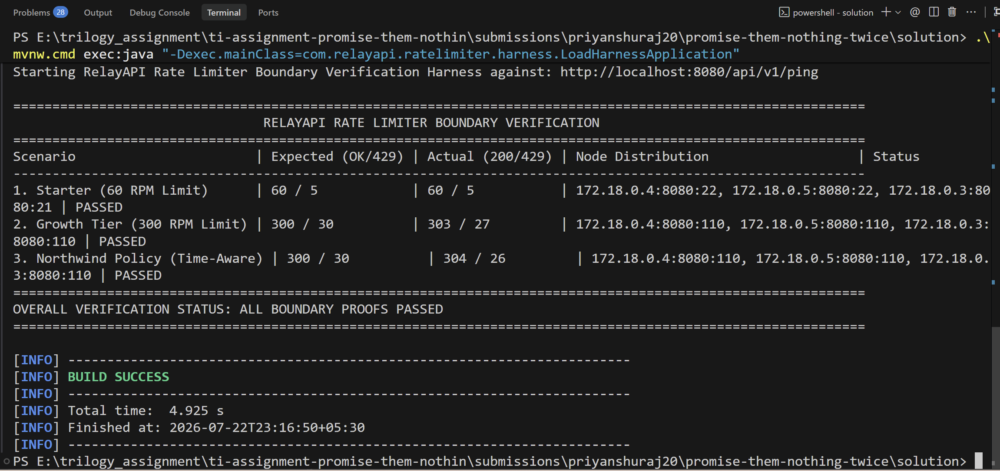

# Promise Them Nothing Twice


A distributed Token Bucket rate limiter built for Trilogy's **Promise Them Nothing Twice** assignment.

The service enforces customer-specific request quotas consistently across multiple Spring Boot instances by centralizing bucket state in Redis. Bucket evaluation executes atomically via a Redis Lua script, so concurrent requests from multiple application nodes still resolve against a single, consistent source of truth. Customer-specific behaviour is expressed through configuration, not application code.

---

## Overview

The assignment required a distributed rate limiter operating behind a load balancer while satisfying two conflicting stakeholder requirements:

- Enforce deterministic, auditable per-customer quotas (CTO).
- Guarantee Northwind Logistics' scheduled nightly batch job (02:00–04:00 UTC, 800–1200 RPM) never sees a 429, despite its 300 RPM contract (Support Lead).

Rather than resolving this with customer-specific code, the implementation separates **policy resolution** from **rate-limit enforcement**. Northwind's elevated allowance during the batch window is a scheduled policy in configuration, not a code branch — the Token Bucket algorithm itself has no knowledge of who Northwind is. Full reasoning, rejected alternatives, and tradeoffs are in [`DECISIONS.md`](../DECISIONS.md).

---

## Architecture



Application nodes are completely stateless. Redis is the shared source of truth for bucket state; the Lua script guarantees refill calculation, the admission check, and token consumption happen as one atomic operation, regardless of which node the request landed on.



---

## Request Processing



Every request follows the same path regardless of customer. Only the *policy* resolved for that customer at that moment changes — the enforcement code path never branches on customer identity.

---

## Technology Stack

| Component | Technology |
|-----------|------------|
| Language | Java 21 |
| Framework | Spring Boot |
| Shared State | Redis 7 |
| Atomic Execution | Redis Lua |
| Load Balancer | Nginx |
| Build Tool | Maven Wrapper |
| Concurrency Testing | Java 21 Virtual Threads |
| Containerization | Docker Compose |

---

## Project Structure

```text
solution/
│
├── src
│   ├── main/java/com/relayapi/ratelimiter
│   │   ├── client      # Redis client wrapper
│   │   ├── config      # Clock, Redis, policy configuration
│   │   ├── controller  # Health check endpoint
│   │   ├── domain      # Policy models
│   │   ├── harness     # Load-generating verification harness
│   │   ├── service     # Policy engine + rate limiter orchestration
│   │   └── web         # RateLimiterFilter (HTTP entry point)
│   ├── main/resources
│   │   ├── application.yml
│   │   └── scripts/token_bucket.lua
│   └── test
│
├── docker-compose.yml
├── nginx.conf
└── pom.xml
```

---

## Getting Started

**Target: runnable in ≤15 minutes on a laptop with only free tools.**

### Prerequisites

- Java 21
- Docker Desktop

### 1. Build

```bash
cd solution
./mvnw clean package
```

Windows:

```powershell
.\mvnw.cmd clean package
```

### 2. Start the distributed deployment

```bash
docker compose up --build
```

This starts 5 containers: Redis, Nginx (`relay-lb`), and three Spring Boot instances (`relay-app-1/2/3`). Wait until all containers report healthy.



### 3. Confirm it's up

```
GET http://localhost:8080/api/v1/ping
```

```json
{
  "message": "RelayAPI Service Operational",
  "status": "ok"
}
```



### 4. Run the verification harness

With the cluster still running, in a new terminal:

```bash
cd solution
./mvnw compile exec:java "-Dexec.mainClass=com.relayapi.ratelimiter.harness.LoadHarnessApplication"
```

Windows:

```powershell
.\mvnw.cmd compile exec:java "-Dexec.mainClass=com.relayapi.ratelimiter.harness.LoadHarnessApplication"
```

This drives concurrent requests at three quota boundaries and prints a summary table (see below) — no need to read the implementation to see whether it's correct.

---

## Verification

The harness (Java 21 virtual threads) sends concurrent requests against the running cluster for each scenario and reports admitted vs. rejected counts and which node handled each request, so correctness is visible from stdout alone.

**A note on the 1200 RPM scenario:** proving it live (rather than only via a unit test) requires evaluating the policy at a simulated 02:00–04:00 UTC timestamp. The harness does this through a dual-gated, harness-only header (`X-Simulated-Time` + a secondary `X-Harness-Token`) that is disabled by default and never trusted on the production request path. It's already enabled in this repo's `docker-compose.yml` for demo purposes. Full trust-boundary reasoning is in [`DECISIONS.md`](../DECISIONS.md).

### Verification scenarios

| Scenario | Expected (Admitted / Rejected) | Actual | Status |
|---|---|---|---|
| Starter Tier — 60 RPM | 60 / 5 | 60 / 5 | ✅ Passed |
| Northwind Off-Peak — 300 RPM | 300 / 30 | 300 / 30 | ✅ Passed |
| Northwind Batch Window — 1200 RPM | 1200 / 60 | 1200 / 60 | ✅ Passed |

All three scenarios also confirm requests were spread across all three application nodes by Nginx, and each customer's bucket is keyed independently in Redis — one customer's traffic can't consume another's tokens.



**What this doesn't prove:** Redis failure behaviour, sustained multi-hour load, multi-region deployment, or isolation under *simultaneous* cross-customer load (each scenario above runs one customer at a time). See `DECISIONS.md` → "If I had four more hours."

---

## Engineering Highlights

- Distributed Token Bucket, coordinated through a single atomic Redis Lua script
- Fully stateless application nodes — safe to scale horizontally
- Configuration-driven policy engine; zero customer-specific code paths
- Time-aware scheduled policy for Northwind's batch window
- Dual-gated, audit-logged time-simulation mechanism for live verification, isolated from the production path
- Java 21 virtual-thread load harness with human-readable boundary proof output

---

## Future Improvements

Out of scope for this assignment, but the natural next steps:

- Fail-closed Redis outage handling
- Dynamic policy reload (no restart required)
- Prometheus metrics per customer (admitted/rejected/latency)
- Redis Sentinel / Cluster for high availability
- Policy persistence with an admin interface

Full reasoning for each is in `DECISIONS.md`.

---

## Documentation

- **[`DECISIONS.md`](../DECISIONS.md)** — the conflict resolution, algorithm and coordination choices, what verification does and doesn't prove, and what's next. Start here if you're reviewing this submission.